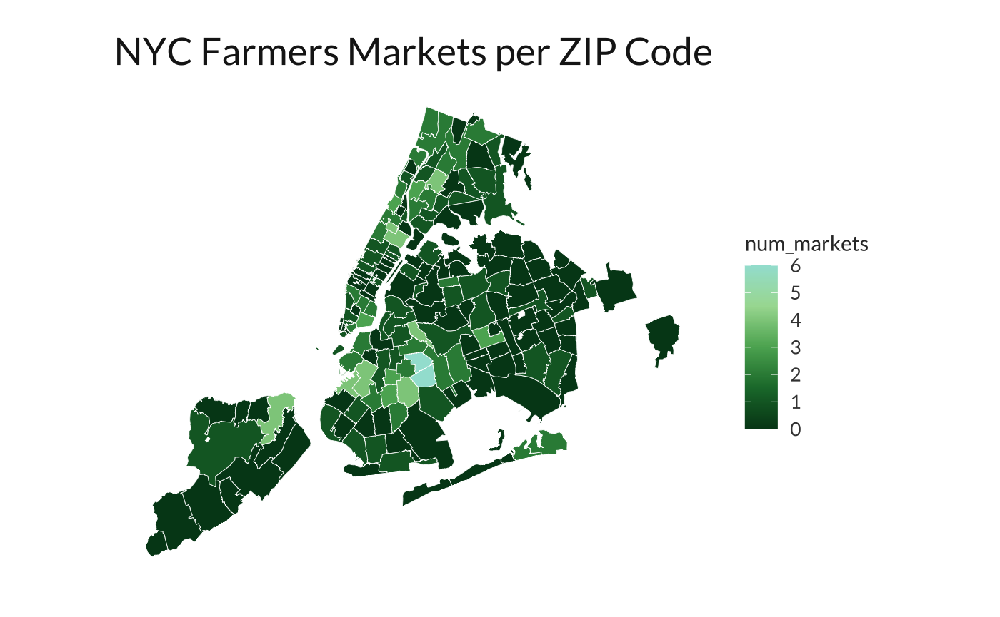
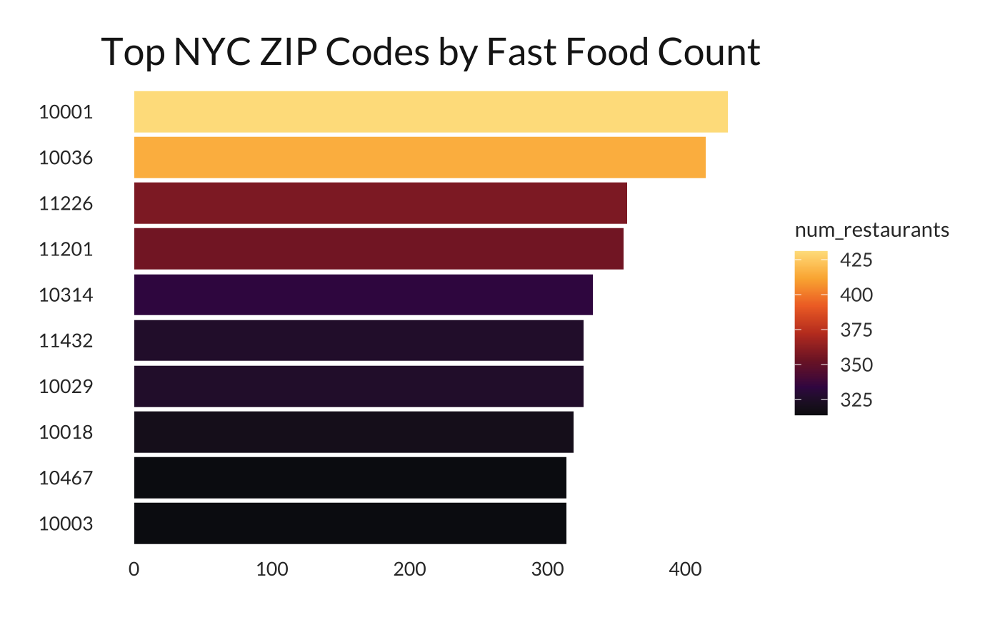
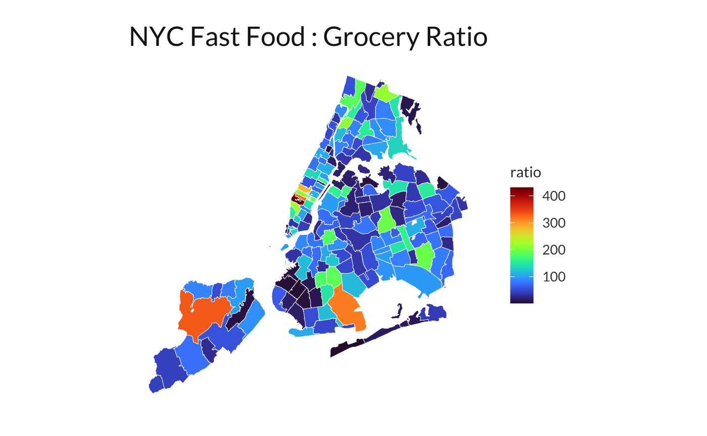
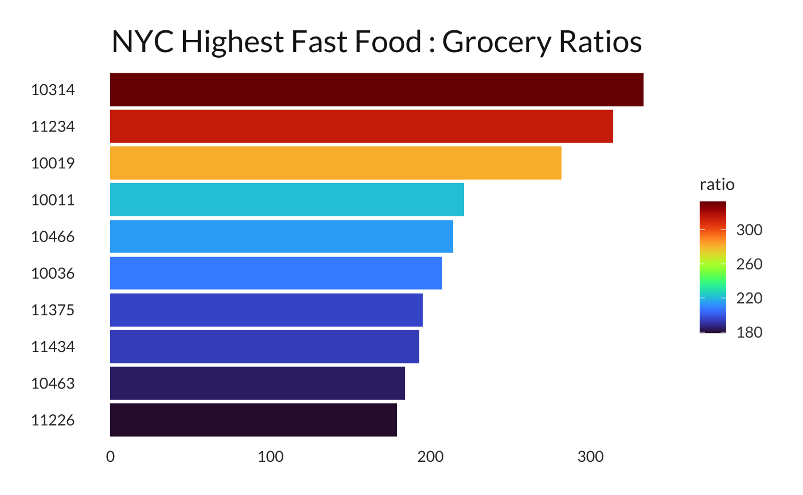
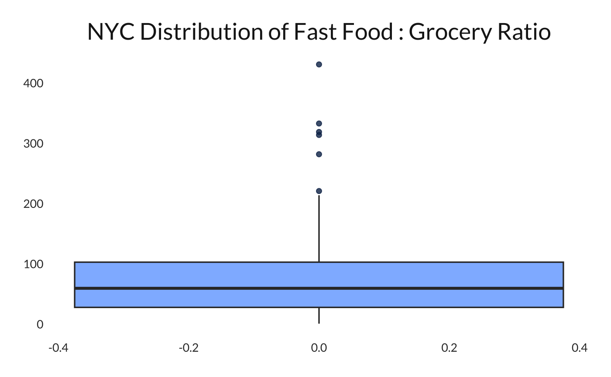

# Freya-Sutter-Personal-Data-Project
## Visualizations

For this project, most of my visualizations are maps because the data is tied to ZIP codes, and being able to look at a map makes the differences much clearer. 

The first map I made shows the total number of fast-food restaurants in each NYC ZIP code. Midtown Manhattan has extremely high counts as some ZIP codes having more than 400 fast-food restaraunts. Several neighborhoods in Brooklyn, the Bronx, and Staten Island also have high amounts, while other areas have much fewer fast-food restaurants.

I also created a map of farmers markets to compare access to fresh food. This map looks completely different from the fast-food one. Many ZIP codes have zero farmers markets, and only a few have more than three. It highlights how unevenly farmers markets are distributed compared to the density of fast-food restaurants.

To make the differences easier to connect to specific zip codes, I also created a bar chart of the top 10 ZIP codes with the highest fast-food counts. ZIP codes such as 10001 and 10036 have more than 400 restaurants each, which is a huge number considering how small a ZIP code area can be. This chart helped me identify the most saturated food environments.

After cleaning the full-service grocery store data, I also created a Fast Food to Grocery Ratio map. Instead of focusing on raw numbers, this map shows how many fast-food restaurants exist for every grocery store in each ZIP code. Some neighborhoods have ratios above 200, and a few are above 300 or even 400. These neighborhoods are the lightest areas on the map and represent the most extreme food imbalance.

I then made a bar chart of the top 10 ZIP codes with the highest ratios. This chart gives a simple way to see which neighborhoods face the biggest gap in food access. ZIP codes such as 10314, 11234, and 10019 stand out as the most extreme cases, where access to full-service grocery stores is very limited compared to the number of fast-food restaurants.

Overall, these visuals show both the overall distribution of food sources in NYC and the specific neighborhoods where food access is the most uneven.

## Analysis

To go beyond the visual analysis, I also used Tukey’s Five-Number Summary and the IQR rule to analyze the fast-food to grocery ratio. This ratio tells me how many fast-food restaurants exist for each grocery store in a ZIP code. The summary was:

- Minimum: 1  
- First Quartile: 28  
- Median: 59.67  
- Mean: 76.29  
- Third Quartile: 103  
- Maximum: 431  

These values show that most ZIP codes fall between about 30 and 100, but a few ZIP codes are far above this range. When I used the IQR method to calculate outliers, several ZIP codes exceeded the upper cutoff. These outliers are visible in my boxplot, where a handful of points sit well above the whiskers.

The most extreme ZIP code had a ratio of 431. This means that for every one grocery store, there are 431 fast-food restaurants. This is not a small imbalance. It represents a completely different food environment from the median ZIP code. These extreme cases match the lightest areas on the ratio map and the highest bars in the top 10 ratio chart.

I chose not to remove the outliers because they are not data errors. They highlight real conditions in specific neighborhoods and help explain why food access varies so much across the city. Using the five-number summary and the IQR method helped me understand how skewed the distribution is and why certain areas show up so dramatically in the visualizations.
